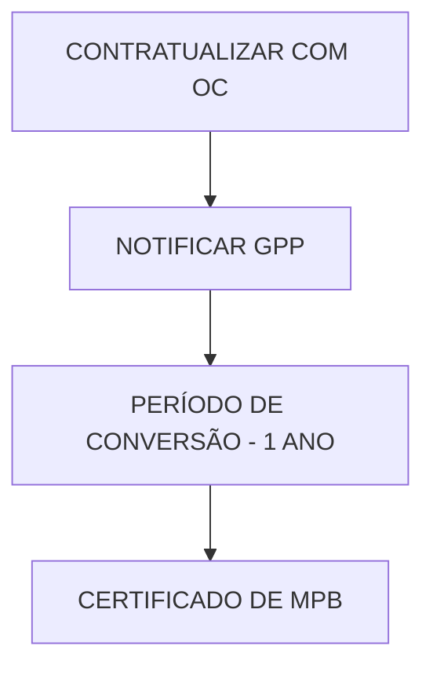

# Manual de Apicultura
## em Modo de Produção Biológico

# Manual de Apicultura em Modo de Produção Biológico

. AGRICULTURA BIOLÓGICA .

Escola Superior Agrária

**CIMO** Centro de Investigação de Montanha

**FNAP**
Federação Nacional dos Apicultores de Portugal

co-financiado por:

FEAGA - Garantia
Programa Apícola Nacional

**programa apícola nacional**

# Manual de Apicultura
## em Modo de Produção Biológico

**Autor:**
Miguel Vilas-Boas – CIMO/ESAB

**Editor:**
FNAP – Federação Nacional dos Apicultores de Portugal
Av. do Colégio Militar Lote 1786, 1549-012 LISBOA

www.amodesign.net

| co-financiado por: |  |  |  |
| --- | --- | --- | --- |
|  | Programa Apícola Nacional | do Desenvolvimento | apícola |
|  | Ano 2008 | Rural e das Pescas | nacional |

# ÍNDICE

  - 4.1. Procedimentos de prevenção e tratamentos de doenças. 34
  - 4.2. Controlo da infestação por varroa: métodos alternativos 36
  - 5.3. Regulamentação de unidades de preparação de produtos de origem animal 47
- 6. OUTRAS FRONTEIRAS DA APICULTURA EM MODO DE PRODUÇÃO BIOLÓGICO 50
- ANEXO I – MODELO DE NOTIFICAÇÃO PARA PRODUTORES AGRÍCOLAS 52

ÍNDICE DE FIGURAS

# ÍNDICE DE FIGURAS

Figura 1. Área em MPB nos países da UE (milhares de ha) .................................................................................... 10
Figura 2. Expressão do mercado europeu de produtos biológicos ..................................................................... 10
Figura 10. Apiário orientado a Sul (orientação e exposição ideal) ........................................................................ 26
Figura 18. Varroas sobre abelhas adultas e larvas ................................................................................................ 36
Figura 21. Tomilho e estrutura química do timol (óleo essencial)........................................................................ 39
Figura 24. Aplicação de ácido oxálico – Gotejamento e vaporização ................................................................. 40
Figura 27. Aplicação de timol em tiras de cartão .................................................................................................. 42
Figura 28. Aplicação de ácido fórmico em algodão .............................................................................................. 42
Figura 29. Aplicação de ácido oxálico por gotejamento ....................................................................................... 43
Figura 30. Resultados obtidos com os tratamentos alternativos ......................................................................... 43
Figura 31. Comportamento das colónias avaliadas (análise de vitalidade) .......................................................... 44
Figura 33. Logótipo do MPB aprovado pela União Europeia ............................................................................... 49
Figura 34. Própolis: abelha recolhendo própolis; grelhas para recolha, processamento ................................... 50

# INTRODUÇÃO

O presente manual pretende promover a Apicultura em Modo de Produção Biológico como mais uma ferramenta ao dispor dos apicultores portugueses para o desenvolvimento da actividade apícola em Portugal.

Desta forma, descreve-se o enquadramento da apicultura no âmbito da agricultura biológica e, de uma forma sucinta, apresentam-se os regulamentos, os procedimentos administrativos e algumas das especificidades no maneio apícola em modo de produção biológico. São focados com particularidade alguns aspectos relativos ao controlo da Varroose, considerado por vezes e de forma sobrevalorizada, como uma das condicionantes neste modo de produção. Aqui apresenta-se a experiência e os resultados obtidos na execução do projecto “Promoção e estímulo à produção biológica de mel” fruto da colaboração entre a Escola Superior Agrária de Bragança, a Associação de Apicultores do Parque Natural do Douro Internacional e a Associação de Apicultores do Parque Natural de Montesinho e financiado pelo programa Agro Medida 8.1 DE&D.

Este manual não substitui uma consulta das disposições regulamentares e pretende apenas servir como um complemento informativo. Em nota final, alerta-se o leitor para a nova regulamentação Europeia, Reg. (CE) n.º 834/2007 a aplicar para o ano de 2009 e a demais legislação que em breve virá complementar este novo regulamento.

# 1. AGRICULTURA BIOLÓGICA

## 1.1 Evolução histórica
Com a industrialização da actividade agrícola foi introduzido nos sistemas de produção uma variedade de produtos químicos como pesticidas, herbicidas, bactericidas e outros medicamentos, para forma de aumentar o rendimento da actividade, mas sem se avaliar o seu impacto na biodiversidade, menosprezando ecossistemas e solos.

O primeiro sinal de preocupação surgiu em Paris em 1972 com a formação do

 International Federation of Organic Agriculture Movements (IFOAM), um agente impulsionador de uma revolução social e ecológica que rapidamente congregou, dos vários continentes, os interessados numa agricultura alternativa. Este aliás veio a constituir a génese do que hoje é designada a Agricultura em Modo de Produção Biológico.

Em 1990 os Estados Unidos (*Organic Foods Production Act of 1990*) e logo a seguir em 1991 a Comunidade Económica Europeia estabeleceram os princípios regulamentares pelos quais se viria a orientar a agricultura em modo de produção biológico, direccionada então para a produção vegetal através do Reg. (CE) nº. 2092/91, mas posteriormente alargado à produção animal e produtos de origem animal, em 2000, e aos alimentos para animais, em 2003, Reg. (CE) nº. 1804/99 e Reg. (CE) nº. 203/2003. O constante desenvolvimento dos mercados agrícolas, as expectativas crescentes dos consumidores sobre os produtos biológicos e a constante evolução do sector agrícola biológico impeliu o aperfeiçoamento constante dos próprios regulamentos Europeus, verificando-se, desde a génese até Fevereiro de 2007, a actualização dos documentos através de 41 rectificações. A partir de 2004-2005 tornou-se claro a necessidade de uma nova regulamentação, perseguindo o objectivo de garantir uma concorrência leal e o funcionamento adequado do sector, mantendo e justificando a confiança dos consumidores nos produtos biológicos, mas também salvaguardando as condições que permitam ao sector desenvolver-se adequadamente em sintonia com a evolução da produção e do mercado. Neste sentido o regulamento (CE) nº. 834/2007, com efeitos a partir de Janeiro de 2009, vem revogar o anterior regulamento no que respeita ao quadro geral de regras de produção biológica e rotulagem, aplicáveis à produção vegetal, animal e à aquicultura. A este regulamento seguir-se-á a aprovação de normas de execução para a produção das determinadas espécies animais, plantas aquáticas e micro-algas, salvaguardando-se, no entanto, a possível transição do anterior regulamento, das normas mais específicas.

A dinâmica da agricultura em modo de produção biológico reflecte-se nos dados estatísticos ao nível da produção e do mercado mundial dos produtos biológicos. Segundo

10 Manual de Apicultura em Modo de Produção Biológico

os valores publicados[1] entre 1995 e 2006 a área agrícola Europeia sob produção biológica passou de 1 milhão de hectares (50 mil operadores) para 6 milhões (160 mil operadores), correspondendo a 23% da área agrícola mundial convertida para este modo de produção, e a 4 % do total da área agrícola da Europa. Portugal apresentava em 2006 269 mil hectares

**Países Europeus com maior área dedicada ao MPB**

| País | Hectares em MPB |
| Suécia | 250000 |
| Polónia | 250000 |
| Portugal | 269000 |
| Republica Checa | 300000 |
| Grécia | 350000 |
| França | 550000 |
| Reino Unido | 600000 |
| Alemanha | 850000 |
| Espanha | 950000 |
| Itália | 1150000 |

FIG.1 Área em MPB nos países da UE (milhares de ha)

(1696 operadores) em agricultura biológica, equivalendo a 7,3% de toda a área agrícola Nacional. Neste contexto, Portugal surge colocado na nona posição a nível mundial, surgindo o Liechtenstein em primeiro com 29%. Já no que se refere ao valor absoluto da área agrícola, Portugal surge na 7<sup>a</sup> posição dos países Europeus e na 17<sup>a</sup> a nível mundial, destacando-se a Austrália com os seus 11 milhões de hectares utilizados (ver figura 1).

| País/Região | Percentagem do Mercado |
| Alemanha | 23% |
| Reino Unido | 15% |
| Itália | 15% |
| França | 14% |
| Suiça | 5% |
| Áustria | 3% |
| Suécia | 3% |
| Holanda | 3% |
| Bélgica | 2% |
| Dinamarca | 2% |
| Restantes | 15% |

FIG.2 Expressão do mercado europeu de produtos biológicos

O mercado dos produtos biológicos (figura 2) apresentou também uma evolução acelerada: entre 2002 e 2006 o valor do mercado dos produtos biológicos aumentou de 18 para 31 mil milhões de euros, onde a América do Norte e a Europa são os maiores consumidores

destes produtos. A Alemanha é o país com contribuição mais elevada para o mercado Europeu representando 23%, seguindo-se outros países como o Reino Unido, a França e Itália. Ao contrário do verificado ao nível da produção, no que se refere ao consumo dos produtos biológicos Portugal apresenta valores pouco significativos.

Neste contexto, e considerando que actualmente a oferta dos produtos biológicos é claramente inferior à sua procura, é evidente a potencialidade da agricultura em modo de produção biológico, prevendo-se que a área utilizada pela agricultura biológica evolua a nível mundial dos 0,7% actuais para os 5%.

## 1.2 Princípios orientadores

Uma questão importante para compreender, aceitar, cumprir e fazer cumprir a regulamentação associada a este modo de produção agrícola é conhecer a resposta à pergunta:

> **O QUE É A AGRICULTURA BIOLÓGICA?**
>
> Para a IFOAM a resposta a esta pergunta está assente em quatro princípios basilares:
>
> **1 O PRINCÍPIO DA SAÚDE**
> A Agricultura Biológica deverá manter e melhorar a qualidade dos solos, assim como a saúde das plantas, dos animais, dos seres humanos e do planeta como organismo uno e indivisível.
>
> **2 O PRINCÍPIO DA ECOLOGIA**
> A Agricultura Biológica deverá basear-se nos sistemas ecológicos vivos e nos seus ciclos, trabalhando com eles, imitando-os e contribuindo para a sua sustentabilidade.
>
> **3 O PRINCÍPIO DA JUSTIÇA**
> A Agricultura Biológica deverá basear-se em relações justas no que diz respeito ao ambiente comum e às oportunidades de vida.
>
> **4 O PRINCÍPIO DA PRECAUÇÃO**
> A Agricultura Biológica deverá ser gerida de uma forma cautelosa e responsável, de modo a proteger o ambiente, a saúde e o bem-estar das gerações actuais e futuras.

Com estes princípios e reconhecendo a necessidade de actualização da própria definição de agricultura biológica, fruto da dinâmica da própria actividade agrícola, muito recentemente, em Junho de 2008, a IFOAM reformulou a resposta à pergunta anterior, colocando-a nos seguintes termos:

> A agricultura biológica é um sistema que sustenta a saúde dos solos, dos ecossistemas e das pessoas. Baseia-se em processos ecológicos, biodiversidade e ciclos adaptados às condições locais, em detrimento do uso de insumos com efeitos adversos. A Agricultura biológica combina tradição, inovação e ciência para o benefício do meio ambiente comum, e promove as relações justas e uma boa qualidade de vida para todos os envolvidos.

12 Manual de Apicultura em Modo de Produção Biológico

Para a Comissão Europeia a resposta é efectuada noutros moldes mas focando o essencial nos mesmos princípios:

> A AGRICULTURA BIOLÓGICA difere dos restantes sistemas agrícolas em diversos modos. Favorece o uso de recursos renováveis e recicláveis, devolvendo ao solo os nutrientes presentes nos resíduos. No que se refere à produção de animais e produtos de origem animal, o maneio dos animais é regulamentado em particular no que se refere ao seu bem-estar animal e ao uso de rações naturais. A agricultura biológica usa os sistemas do próprio meio para controlar pragas e doenças, na melhoria das colheitas e produção animal e evita o uso de pesticidas sintéticos, herbicidas, fertilizantes químicos, hormonas do crescimento, antibióticos ou manipulações genéticas. Alternativamente, os agricultores biológicos utilizam um leque de técnicas que ajudam a sustentar os ecossistemas e a reduzir a poluição.

Assim, podemos concluir que o conceito de agricultura biológica é uma forma de inter-relação entre o Homem e a Natureza, não podendo, de forma alguma, ficar a sua definição reduzida apenas a uma actividade ou produto certificado.

> **APLICAÇÃO DOS PRINCÍPIOS ORIENTADORES DA AGRICULTURA BIOLÓGICA**
> - Preservar o ecossistema: culturas apropriadas e sistemas de rotação, aplicação de adubos “verdes”, luta biológica contra pragas e doenças, uso e selecção de raças autóctones, garantir uma produção segundos os princípios éticos e necessidades do comportamento natural e bem-estar animal.
> - Sustentabilidade do ecossistema: reciclar e reutilizar os restos de origem animal ou vegetal, depender de recursos renováveis em sistemas agrícolas organizados localmente, garantir a diversidade genética.
> - Responsabilidade social: valorização e distribuição equitativa do valor real dos produtos pelos envolvidos, fixação das populações, garantir ao consumidor o direito à escolha de produtos isentos de OGM e a qualidade dos produtos, promover as actividades tradicionais mas envolvendo de forma racional e acautelada a inovação e a ciência.

## 1.3 Apicultura

A apicultura, definindo-se como uma actividade de produção animal, ficou enquadrada no âmbito da Agricultura Biológica com a legislação introduzida através dos regulamentos (CE) nº. 1804/99 e recentemente o (CE) nº. 834/2007. Dadas as especificidades atribuídas a este tipo de produção animal, a apicultura em modo de produção biológico está sujeita a regras específicas de produção, estando vigentes as do anterior regulamento, Parte C do

anexo I, mas prevendo-se que, com algumas actualizações, venham a manter-se no essencial.

Segundo a legislação Europeia a ostentação num produto da referência biológico, quer na rotulagem, na sua publicidade, ou qualquer documento comercial, implica o cumprimento de todas as regras definidas pelo Reg. (CE) nº2092/91 agora revogado. Esta condição aplica-se a todos os produtos vegetais e animais não transformados e aos produtos agrícolas transformados destinados à alimentação humana e aos alimentos para animais. Desta forma, garante-se ao consumidor que o produto em causa foi obtido segundo um modo de produção biológico definido no regulamento.

| Um produto obtido por um ser vivo ou resultante da sua acção NÃO GARANTE a sua definição como biológico. | São apenas “produtos biológicos” aqueles com origem num MODO DE PRODUÇÃO BIOLÓGICO ou resultante da sua transformação. |

> O MODO DE PRODUÇÃO BIOLÓGICO é um sistema de exploração agrícola especial que se rege por princípios mínimos regulamentados, garantidos ao consumidor através de um ORGANISMO CERTIFICADOR ACREDITADO.

Neste sentido, o facto de o mel ser produzido por um ser biológico, a abelha, não lhe confere qualquer reconhecimento, pois nada garante ao consumidor que o néctar, o pólen, a água, o material apícola ou o maneio da abelha se encontram dentro dos princípios orientadores da agricultura biológica. Assim, será mais adequado definir em alternativa:

14 Manual de Apicultura em Modo de Produção Biológico

Em Portugal, segundo os dados apresentados no Programa Apícola Nacional 2008-2010 [2], a actividade apícola é exercida por 15 mil apicultores registados, correspondendo a um total de 555 mil colmeias. A sua distribuição geográfica no continente é relativamente homogénea, com os extremos no Alentejo e na região Entre Douro e Minho.

No contexto nacional, a apicultura em modo de produção biológico é ainda irrelevante, sobressaindo a evolução acentuada dos últimos anos, mas ainda pouco significativa. Segundos os dados da Comissão Europeia[3], representa apenas 0,25% da produção biológica Portuguesa. Este valor é compreensível considerando que em 2005 apenas se encontravam registados 25 operadores com um total de 1359 colmeias, correspondendo também a 0,25 % do total de colmeias nacionais (ver figura 3).

### Número de colmeias em MPB

| Região | 2003 | 2004 | 2005 |
| --- | --- | --- | --- |
| Alentejo | 0 | 130 | 350 |
| Algarve | 30 | 30 | 30 |
| B. Interior | 0 | 0 | 0 |
| B. Litoral | 0 | 10 | 40 |
| E.D.M. | 0 | 0 | 110 |
| R. Oeste | 0 | 20 | 50 |
| T. Montes | 210 | 350 | 779 |

Fonte: DGADR

FIG.3 Efectivo Apícola Nacional em MPB

Existe assim uma enorme janela de oportunidade pois estes valores estão muito abaixo das metas internacionais, e mesmo dos 7,3 % que representa actualmente a agricultura biológica Portuguesa no contexto geral da agricultura, ao que deveria corresponder mais de 40 mil colmeias. A este factor de atracção adiccionam-se outros dois: as grandes potencialidades que Portugal tem com condições geográficas adequadas ao modo de produção biológico e a valorização dos produtos biológicos que atinge com regularidade um acréscimo de 30% comparativamente ao valor do produto obtido em modo convencional.

# 2. ENQUADRAMENTO LEGAL – REGULAMENTAÇÃO E CERTIFICAÇÃO

## 2.1 Regulamento Europeu
Neste capítulo ter-se-á como base o regulamento (CE) nº. *834/2007* a vigorar a partir de Janeiro de 2009, salvaguardando, no entanto, que os critérios aplicáveis à apicultura em particular seguirão no essencial o anterior regulamento (CE) nº *2092/91*.

Este novo documento:
* Estabelece mais explicitamente os objectivos, princípios e regras de produção da agricultura biológica, embora prevendo uma flexibilidade que permite ter em conta condições e fases de desenvolvimento locais;
* Assegura uma aplicação uniforme dos objectivos e princípios em todas as fases da produção biológica, nos sectores da produção animal e vegetal, da aquicultura e dos alimentos para animais, bem como no sector da produção de alimentos biológicos;
* Clarifica as regras para OGM, nomeadamente esclarece que a utilização de produtos OGM se mantém estritamente banida da produção biológica e que o limiar geral de 0,9% para a presença acidental de OGM se aplica igualmente aos alimentos biológicos,
* Impõe o logótipo da UE aos produtos biológicos Nacionais, autorizando, no entanto, que surja acompanhado de logótipos Nacionais ou privados para promoção do “conceito comum” de produção biológica;
* Não proíbe normas particulares mais rígidas, desde que também sejam aplicadas à agricultura em modo convencional;
* Garante que só serão rotulados como biológicos os alimentos que contenham, no mínimo, 95% de ingredientes biológicos;
* Para os produtos não biológicos só autoriza a referência a ingredientes biológicos na lista de ingredientes;
* Privilegia uma abordagem baseada em controlo de riscos e melhora o sistema de controlo, harmonizando-o com o sistema de controlo alimentar da União Europeia, aplicável a todos os géneros alimentícios e alimentos para animais, mas mantendo controlos os específicos utilizados na produção biológica;
* Cria um novo regime de importação permanente, permitindo que países terceiros exportem para o mercado da UE em condições idênticas aos produtores da UE;
* Exige a indicação do local de produção, incluindo dos produtos importados que ostentem o logótipo da UE;
* Cria a base para a existência de novas regras em matéria de aquicultura, vinho, algas e leveduras biológicos;

16 Manual de Apicultura em Modo de Produção Biológico

* Não altera a lista de substâncias autorizadas na produção biológica, passando a exigir uma publicação dos pedidos de autorização para novas substâncias e um sistema centralizado de decisão para as excepções;
* É a base que permite transferir, do antigo para o novo regulamento, nomeadamente, as listas de substâncias, as regras de controlo e outras regras pormenorizadas.

Estruturalmente o regulamento é apresentado de uma forma agregada e organizado em 7 títulos:

# ORGANIZAÇÃO DO REGULAMENTO (CE) Nº. 834/2007

1. OBJECTIVO, ÂMBITO DE APLICAÇÃO E DEFINIÇÕES: O regulamento é aplicado aos produtos agrícolas vivos ou não transformados, aos transformados em géneros alimentícios, aos alimentos para animais, ao material de propagação vegetativa e sementes e às leveduras. Excluiu-se os produtos da caça e pesca selvagem. As regras são aplicáveis em qualquer fase da produção/preparação/distribuição e controlo.

2. OBJECTIVOS E PRINCÍPIOS DA PRODUÇÃO BIOLÓGICA: É privilegiada a gestão agrícola sustentável, os produtos de elevada qualidade e promotores da saúde humana e bem-estar animal, e é acentuada a restrição ao uso de produtos externos, em especial produtos de síntese química. Refere claramente a necessidade de flexibilizar as regras de produção em função do estado sanitário, das diferenças climáticas regionais e das práticas específicas de criação.

3. REGRAS DE PRODUÇÃO: Fica claro a incompatibilidade entre produtos biológicos e organismos geneticamente modificados (OGM), bem como o recurso a radiações ionizantes. É permitida a produção biológica e convencional numa mesma exploração, desde que separadas no tempo e espaço e adequadamente registadas e controladas. São descritas neste ponto as regras relativas às várias produções agrícolas (vegetal, algas marinhas, animal e aquicultura), bem como as substâncias de uso autorizado em MPB e o período de conversão. A descrição específica das substâncias mantém-se a do anexo II do regulamento anterior. São também definidas as regras de produção de bens transformados em géneros alimentícios ou para alimentação animal.

4. ROTULAGEM: São definidas condições relativa ao uso de termos como “eco” ou “bio” que possam sugerir ao consumidor que o produto foi obtido em conformidade com as regras de produção biológica. Apresentam-se as indicações obrigatórias de rotulagem, e a necessidade de inclusão do logótipo comunitário.

> 5. CONTROLOS: Neste ponto é referida a organização de todo o processo de controlo, desde o estabelecimento de critérios que permitem ao estado membro atribuir ou delegar esta tarefa a um organismo de controlo certificado, até aos procedimentos a que está sujeito qualquer operador em modo de produção biológico. Descrevem-se também as medidas a tomar em casos de infracção ou irregularidade.
>
> 6. RELAÇÕES COM PAÍSES TERCEIROS: A importação de produtos de países exteriores ao mercado comunitário é autorizada desde que sejam cumpridos os regulamentos estabelecidos e que o operador, incluindo exportadores, sejam controlados por uma autoridade ou organismo de controlo reconhecido.
>
> 7. DISPOSIÇÕES FINAIS E TRANSITÓRIAS: Na parte final do documento são apresentadas algumas medidas finais, como o reconhecimento e a livre circulação dos produtos biológicos no mercado Europeu, sem necessidade de qualquer controlo adicional, a transmissão de informação à comissão, e a apresentação de um comité de produção biológica, responsável pela apresentação da documentação complementar, onde estarão incluídas as regras específicas determinadas produções animais, como a apicultura.

As regras a aplicar na apicultura, e dado tratar-se de uma produção animal muito particular, carecem de uma regulamentação complementar, a qual no antigo regulamento constituía a parte C do Anexo I. Considerando a simplificação que resulta deste novo regulamento e a flexibilização que se pretendeu impor ao documento, é de prever que as regras pormenorizadas sejam transpostas na globalidade. Estas regras aplicam-se à apicultura e aos produtos da apicultura e são estruturadas em 8 pontos:

> 1 - PRINCÍPIOS GERAIS
> * A actividade das abelhas é vista como forma de protecção ambiental e como produção agrícola e florestal – POLINIZAÇÃO.
> * A QUALIDADE dos produtos é dependente dos tratamentos aplicados nas colónias e da qualidade do ambiente, mas também das condições de extracção, tratamento e armazenamento dos produtos apícolas.

> 2 - CONVERSÃO:
> * Os produtos apícolas só poderão ostentar a referência a MPB APÓS UM ANO de aplicação das disposições previstas no regulamento.

18 Manual de Apicultura em Modo de Produção Biológico

# 3 - ORIGEM DAS ABELHAS:

*   Uso de raças Europeias de *Apis mellifera* e dos seus ecotipos locais: **RAÇAS AUTÓCTONES E ADAPTADAS ÀS CONDIÇÕES LOCAIS**.
*   Constituição de apiários por:
    - **AQUISIÇÃO** de colmeias em MPB;
    - **DIVISÃO** de colónias;
    - Por **CONVERSÃO**, com autorização do organismo de controlo.
*   **RENOVAÇÃO** anual, até ao limite de 10%, de rainhas ou enxames provenientes de produção em modo convencional.
*   **RECONSTITUIÇÃO** em casos de mortalidade excepcional ou indisponibilidade de aquisição de colmeias em MPB (requer autorização e um período de conversão).

FIG.4. Princípios orientadores

| Origem | Localização | Sanidade |
| --- | --- | --- |

# 4 - LOCALIZAÇÃO DE APIÁRIOS

*   O estado membro pode delimitar **ZONAS INTERDITAS** ao modo de produção biológico.
*   Ao apicultor compete:
    *   **IDENTIFICAR** por cartografia o local do apiário ao organismo de controlo.
    *   **DEMONSTRAR** que as zonas acessíveis às colónias cumprem os requisitos em termos de:
        - Acesso a água;
        - Fontes naturais de néctar, melada e pólen em quantidade suficiente e provenientes de culturas em MPB, vegetação espontânea ou sujeitas a tratamentos de baixo impacto ambiental;
        - Distância a focos de contaminação, ex: estradas, centros urbanos, zonas industriais, aterros, etc.

## 5 - ALIMENTAÇÃO

* ASSEGURAR RESERVAS de mel e pólen em abundância
* QUANDO EM RISCO DE SOBREVIVÊNCIA usar alimentação artificial:
    * Mel de MPB, preferencialmente do apiário;
    * Xaropes de açúcar ou melaços de açúcar de MPB.
* A ALIMENTAÇÃO ARTIFICIAL implica:
    * O registo dos produtos, datas, quantidades e colmeias;
    * A aplicação está limitada ao final da cresta e até 15 dias antes do início da produção.

## 6 - PROFILAXIA E ASSISTÊNCIA VETERINÁRIA

* SELECÇÃO de raças resistentes;
* USO DE BOAS PRÁTICAS que desenvolvam a resistência a doenças e prevenção de infecções;
* RENOVAÇÃO periódica de rainhas (substituição/desdobramentos);
* INSPECÇÃO frequente;
* CONTROLO de machos;
* DESINFECÇÃO de material e equipamento e destruição de material contaminado;
* RENOVAÇÃO periódica de ceras;
* RESERVAS adequadas de pólen e néctar nas colónias;
* Para o controlo da Varroa são autorizados os seguintes princípios activos:
    * ÁCIDOS ORGÂNICOS: Ac. Acético, Fórmico, Láctico e Oxálico;
    * ÓLEOS ESSENCIAIS: Cânfora, Eucaliptol, Mentol e Timol.

* Quais medicamentos?
    * Apenas os AUTORIZADOS PELO ESTADO MEMBRO, de acordo com as disposições comunitárias;
    * Fitoterapêuticos e homeopáticos.

O uso de produtos de síntese química é excepcional e apenas sob responsabilidade veterinária (apiário de isolamento.). São proibidos tratamentos preventivos:

> **REQUER PERIODO DE CONVERSÃO E TROCA DE CERAS**

**A APLICAÇÃO DE MEDICAMENTOS REQUER AINDA:**
* Diagnóstico;
* Registo dos medicamentos usados;
* Tipo de medicamento /substância activa;
* Posologia e forma de administração;
* Duração do tratamento e intervalo de segurança.

20 Manual de Apicultura em Modo de Produção Biológico

## 7 - PRÁTICAS DE GESTÃO DA PRODUÇÃO

* PRODUÇÃO
    * PROIBIDO destruir as abelhas nos favos como método de colheita;
    * PROIBIDO mutilações (corte das asas da rainha);
    * PROIBIDO o uso de repelentes químicos de síntese;
    * PERMITIDO eliminar criação de machos, mas apenas como controlo da varroa;
    * PERMITIDO substituir a rainha por eliminação da antiga.
* IDENTIFICAÇÃO:
    * OBRIGATÓRIO registar o apiário e colmeias e informar o OC da sua deslocação;
    * ASSEGURAR a adequada extracção, tratamento e armazenamento dos produtos da apicultura;
    * REGISTAR as medidas tomadas;
    * REGISTAR as operações de remoção de alças e extracção de mel.

## 8 - CARACTERÍSTICAS DAS COLMEIAS E MATERIAIS UTILIZADOS NA APICULTURA

* MATERIAL NATURAL, isento de riscos de contaminação;
* No interior da colmeia só é permitido o uso da PRÓPOLIS, CERA E DE ÓLEOS VEGETAIS;
* PERMITIDOS tratamentos físicos (vapor de água e chama);
* Produtos de protecção dos materiais – Anexo II, B, ponto 2;
* Produtos de limpeza e desinfecção – Anexo II, E.

FIG.5. Princípios orientadores

## 2.2 Organismos de controlo e certificação

A agricultura biológica é caracterizada por um elevado rigor na aplicação dos seus princípios para garantir ao consumidor um produto que, para além da sua elevada qualidade, cumpriu determinados requisitos na sua elaboração. O rótulo de produto de agricultura biológica é um certificado para o consumidor. Para garantir esta marca de confiança do consumidor é preciso controlar todos os processos de produção, transformação, armazenamento e distribuição. Este controlo ao longo de toda a linha produtiva é efectuado por um Organismo de Controlo, OC, o qual é representado por uma autoridade de um Estado Membro, ou por um organismo privado devidamente reconhecido e certificado pela autoridade. Em Portugal estão actualmente acreditados pela autoridade Nacional 8 organismos privados, com capacidade de contratualizar com o operador todo o processo de controlo e certificação para o modo de produção biológico.

> **ORGANISMOS DE CONTROLO E CERTIFICAÇÃO (OC)**
> **MODO DE PRODUÇÃO BIOLÓGICO**
> * PT/AB09 SGS Portugal – Sociedade Geral de Superintendência, S A.
> * PT/AB08 CODIMACO – Ass. Interprofissional Gestora de Marcas Colectivas.
> * PT/AB07 TRADIÇÃO E QUALIDADE – Ass. Interprofissional para os Produtos Agro-Alimentares de Trás-os-Montes.
> * PT/AB06 AGRICERT – Certificação de Produtos Alimentares, Lda.
> * PT/AB05 CERTIALENTEJO – Certificação de Produtos Agrícolas, Lda.
> * PT/AB04 CERTIPLANET – Certificação da Agricultura, Florestas e Pescas, Unipessoal, Lda.
> * PT/AB03 SATIVA – Desenvolvimento Rural, Lda.
> * PT/AB02 ECOCERT PORTUGAL – Unipessoal Lda.

### 2.2.1 Processo administrativo de certificação

Todos os interessados em iniciar ou converter a sua exploração para o modo de produção biológico têm como ponto de partida desencadear o processo de controlo e certificação. Este processo envolve três entidades: o operador (apicultor, transformador ou embalador), o organismo privado de certificação e o Gabinete de Planeamento e Políticas (GPP) que actua aqui como a entidade representante do estado Português. O primeiro passo é estabelecer um contrato de serviços entre o operador e o OC. Posteriormente, o operador (produtor ou transformador) deverá efectuar uma notificação da actividade ao GPP preenchendo o formulário disponível em http://www.gppaa.min-agricultura.pt/Biologica/ (ver anexo I).

22 Manual de Apicultura em Modo de Produção Biológico

Após receber a notificação deverá enviar uma cópia da mesma ao organismo certificador, iniciando-se aí o processo de conversão, que terminará um ano após o seu início. Ultrapassado este período, o OC emitirá um certificado de conformidade, permitindo que a produção após o ano de conversão (mantendo-se os requisitos) seja a primeira obtida em modo de produção biológico, podendo o produto ser comercializado com o rótulo de agricultura biológica.



**Durante este processo compete ao organismo de controlo e certificação:**

1. Verificar se o operador tomou as medidas de precaução necessárias para satisfazer a regulamentação e evitar situações graves.
2. Efectuar inspecções, organizadas e aleatórias, para avaliar se todas as medidas de precaução continuam a ser mantidas, cumprindo as regras da Agricultura Biológica, no mínimo uma vez ao ano.
3. Certificar com prova documental o operador, para que os produtos obtidos possam ostentar menções e símbolos que indiquem ao consumidor que se trata de um produto da Agricultura Biológica.

# 3. PRODUÇÃO BIOLÓGICA DE MEL

## 3.1 Equipamento apícola e manutenção

A apicultura, como qualquer actividade específica, requer a utilização de equipamento e ferramentas adequadas às funções a desempenhar, e que devem ser preservadas através de uma manutenção permanente e cuidada. Considerada como uma actividade de pastoreio com animais não domesticados (a abelha comum em Portugal, *Apis mellífera ibérica*, é por hábito um insecto agressivo) é fundamental que o apicultor tenha hábitos de prevenção da sua própria segurança, não devendo nunca facilitar no equipamento. Das diversas ferramentas podem realçar-se dois grupos de equipamentos apícolas essenciais:

**PARA O APICULTOR**

* Fato de cor clara e máscara, para protecção do corpo e da cara;
* Luvas de couro ou outro material, para protecção das mãos;
* Polainitos, para protecção dos tornozelos (ou calçado de cano alto).

FIG.6. Equipamento protector para o apicultor

**PARA AS ABELHAS**

* Colmeias e alças, para colocação do enxame e recolha do mel;
* Fumigador, para controlar a agressividade das abelhas;
* Raspador, levanta-quadros, garfo desoperculador e escova, para manuseamento das colónias.

FIG.7. Equipamento para trabalho de campo

24 Manual de Apicultura em Modo de Produção Biológico

Na apicultura em modo de produção biológico não se encontra legislação específica relativa ao tipo de material dos equipamentos, salvaguardando-se apenas que:

> AS COLMEIAS E OS MATERIAIS UTILIZADOS NA APICULTURA SÃO ESSENCIALMENTE CONSTITUÍDOS POR MATERIAIS NATURAIS.

As maiores interrogações ao nível do equipamento estão relacionadas com o material utilizado na construção das colmeias e mais especificamente nos produtos aplicados para protecção desses materiais. Habitualmente são comercializadas colmeias pintadas ou emalhetadas, recorrendo-se a tintas ou vernizes para protecção exterior da madeira. Nenhum produto deste tipo consta no ponto 2 do anexo II-B (antigo regulamento), surgindo apenas a possibilidade de utilização de parafina como protector. Em contrapartida, o regulamento, não impõe limitações específicas ao material da colmeia num apiário em conversão, pelo que desde que se cumpra o período de reconversão, o material convencional é admitido em modo de produção biológico.

Assim, e com base nos princípios descritos anteriormente para o MPB:
* Qualquer fato de apicultor, máscara e luvas é adequado, desde que seja lavável.
* Para o material de manuseamento deve-se optar pelo inox, que pode ser facilmente desinfectado com álcool ou à chama.
* No fumigador **não é permitido** a utilização de produtos químicos no material de combustão, devendo o apicultor utilizar apenas materiais de origem natural, nomeadamente as ervas habitualmente presentes em redor do apiário.
* O material base de construção da colmeia deve ser a madeira por se tratar de um produto de origem natural, e **nunca o plástico ou a esferovite**. Nos apiários em conversão podem ser mantidas as colmeias convencionais (pintadas ou emalhetadas). No caso de uma instalação nova em modo de produção biológico, deverá o apicultor questionar previamente o OC sobre os materiais, realçando sempre que o mel, durante a sua produção, não se encontra em contacto directo com os materiais exteriores de protecção das madeiras. No interior da colmeia só é permitida a utilização da própolis, cera e óleos vegetais.

A manutenção do equipamento é fundamental para a sua preservação e para evitar o risco de propagação de doenças. De seguida apresentam-se algumas orientações a considerar.

> ### MANUTENÇÃO
> DEVE-SE DESINFECTAR O EQUIPAMENTO:
> * Com frequência;
> * Idealmente entre cada colónia inspeccionada, mas PELO MENOS ENTRE CADA APIÁRIO;
> * Sempre que se desconfia de uma colónia doente.
> 
> A desinfecção, em MPB, pode ser efectuada com (anexo II – E):
> * Chama directa ou vapor;
> * Álcool;
> * Imergindo o material em lixívia ou soluções de soda cáustica (hidróxido de sódio)
> 
> > **O MATERIAL CONTAMINADO DEVE SER INCINERADO**

### 3.1.1 Cera
A cera surge aqui em separado, pois é um material utilizado na apicultura e simultaneamente é um produto apícola. Aqui a legislação discrimina a sua proveniência uma vez que está em contacto permanente com o mel. O objectivo é utilizar cera isenta de quaisquer substâncias que possam contribuir para a contaminação do mel. Desta forma, a cera a utilizar deve ser obtida em MPB, preferencialmente do mesmo apiário. Excepcionalmente, na indisponibilidade de adquirir no mercado cera certificada, é possível, como medida transitória, utilizar a cera de opérculos proveniente de colmeias em modo de produção convencional.

### 3.2 Instalação do Apiário em MPB
Um apiário em modo de produção biológico requer do apicultor alguns cuidados na sua instalação mas também na sua manutenção, promovendo-se atitudes preventivas que contribuam para o bem-estar das colónias. Assim, deve-se atender a três pontos:
* Local de instalação;
* Instalação das colmeias;
* Povoamento das colmeias.

### 3.2.1 Local de instalação
O ponto de partida para iniciar ou converter a sua exploração para o modo de produção biológico é a escolha do local. Ao apicultor cabe encontrar um local adequado. Assim, o local escolhido deve:
* Possuir fontes naturais de néctar, melada e pólen em abundância, num raio de 3 km, provenientes essencialmente de:

26 Manual de Apicultura em Modo de Produção Biológico

- Culturas em modo de produção biológico;
- Vegetação espontânea (ver Figura 8);
- Culturas sujeitas a tratamentos de baixo impacto ambiental.
* Encontrar-se distante de focos de contaminação: centros urbanos, auto-estradas, zonas industriais, aterros, etc.
* Ter acesso a água.

FIG.8. Vegetação espontânea
FIG.9. Apiário em meia-encosta

Para além destes requisitos específicos para o modo de produção biológico devem também ser considerados os cuidados comuns na instalação de qualquer apiário, nomeadamente quanto à localização:
* Local acessível durante todo o ano, de preferência com acesso ao automóvel para carga e descarga de material;
* Distância obrigatória a animais, pessoas e outros apiários definidas no Decreto-Lei nº 37/2000 de 14 de Março: 100 metros de prédios urbanos e vias públicas e 100, 400 ou 1000 metros de apiários com 10, 25 ou 100 colónias.

Quanto à exposição:
* Locais com boa exposição solar, mas não muito quentes;
* Locais com muita água, mas secos;
* Planícies ou meias encostas, abrigados em especial de ventos do norte (ver figura 9).

No que respeita à orientação:
* Colmeias viradas a sul ou nascente aumentam a incidência de luz e estimula a actividade das abelhas (ver figura 10);
* Minimizar as alterações exteriores após instalação, para não promover a desorientação das abelhas.

FIG.10. Apiário orientado a Sul (orientação e exposição correcta)

Por fim e relativamente à disponibilidade de recursos:
* Proximidade a locais com água aumenta a produtividade da colónia;
* Fontes de néctar, pólen e própolis em abundância num raio de 3 km.

Após a identificação do local compete ao apicultor/operador contactar o organismo certificador e:
* Identificar cartograficamente a localização do apiário;
* Demonstrar que as zonas acessíveis às abelhas cumprem as condições exigidas.
O local será posteriormente avaliado pelo OC e certificado. **Este procedimento pode ser efectuado sem a existência de colónias no local.**

### 3.2.2 Instalação de colmeias
Para uma boa preparação do terreno deve-se:
* Efectuar UMA LIMPEZA DA VEGETAÇÃO em redor do apiário, contribuindo para a prevenção de incêndios. A limpeza deve ser efectuada por corte da vegetação ou movimento de terras. **É proibida a utilização de herbicidas.** Este procedimento deve ser realizado antes da colocação das colmeias e fora das épocas de produção (Inverno).
* Criar um corredor de trabalho por detrás das colónias para permitir a circulação de um automóvel de carga/descarga.
* Manter-se uma distância de trabalho entre colmeias de 1 metro, o que facilita a posterior realização de desdobramentos e reduz a deriva das abelhas.

As colónias devem ser **colocadas sobre assentos** e nunca directamente sobre o solo, permitindo assim que se prolongue o tempo de vida do material e se reduza o ataque de formigas e ratos. Adicionalmente e com **inclinação das colmeias para a frente**, é possível diminuir a humidade e consequentemente a probabilidade de doenças na colónia.

28 Manual de Apicultura em Modo de Produção Biológico

As colmeias devem possuir cores suaves para reduzir a agressividade das abelhas e a sua distribuição no apiário deve, dentro do possível, ser alternada e com direcções de voo distintas, reduzindo-se assim a deriva (ver figura 12).

## 3.2.3 Povoamento das colmeias

No modo de produção biológico é promovida a utilização de raças Europeias de *Apis mellifera* e dos seus ecotipos locais, garantindo-se assim a preservação das espécies, a diversidade dos ecossistemas e o recurso a um património genético adaptado às condições locais. Em Portugal deve por isso utilizar-se a abelha *Apis mellifera ibérica*.

O povoamento inicial das colmeias pode ser efectuado por:
* Conversão de colónias de modo convencional para MPB;
* Aquisição de enxames ou colmeias oriundas de explorações em MPB certificadas.

No primeiro caso o rótulo de produção biológica é atribuído apenas após um ano de reconversão, enquanto no segundo caso a certificação biológica é obtida de imediato.

Para repovoar ou aumentar o efectivo pode-se efectuar o desdobramento de colónias em MPB. Em complemento, pode efectuar-se a recolha de enxames selvagens, mas o seu número é limitado a um máximo de 10%/ano do efectivo apícola. Em qualquer uma destas duas situações é necessário colocar as enxames em núcleos ou ninhos e utilizar ceras adequadas ao modo de produção biológico. A recolha de enxames em redor do próprio apiário não garante a sua origem, pelo que o OC pode condicionar a inclusão deste enxames nos 10% acima mencionados (ver figura 13).

FIG.13. Recolha de enxame

Em casos de **mortalidade anormal**, resultante de uma catástrofe ou de uma situação sanitária, e na indisponibilidade de adquirir colmeias oriundas de apiários certificados em MPB, pode-se efectuar o repovoamento com colmeias provenientes de modo convencional. **Esta situação requer a autorização prévia do OC e um período de conversão.**

## 3.3 Maneio apícola e gestão da produção

Para maximizar a produção apícola é necessário proceder a um controlo contínuo das colónias durante todo o ano: no Inverno, avaliar as reservas e o estado das colónias, preparando o material para a próxima produção e realizando a manutenção dos apiários; na primavera, efectuar os tratamentos, a gestão do efectivo e a produção de mel; no verão, controlar a produção e efectuar a cresta do mel; e no Outono, realizar os tratamentos e preparar a colónia para o Inverno. Estas tarefas distribuem-se entre:

* Inspecção e manutenção de apiários/colónias;
* Alimentação artificial;
* Controlo da população;
* Produção de mel;
* Registos.

No caso particular da apicultura em modo de produção biológico há algumas práticas de gestão da produção **PERMITIDAS** e outras **PROIBIDAS**. Na realização destas tarefas há procedimentos de identificação **OBRIGATÓRIOS**.

> ### GESTÃO DA PRODUÇÃO EM MPB
> #### PROCEDIMENTOS PERMITIDOS
> * Eliminar criação de machos apenas para controlo da varroa.
> * Substituição de rainhas por supressão da antiga.
> * Tratamentos físicos (vapor de água e chama).
> * Uso da própolis, cera e óleos vegetais no interior da colmeia.
> * Alimentação artificial, mel da UP ou melaços de MPB, em caso de sobrevivência e fora da época de produção.
> * Introdução até 10%/ano de enxames ou rainhas de apicultura convencional.

30 Manual de Apicultura em Modo de Produção Biológico

## GESTÃO DA PRODUÇÃO EM MPB
### PROCEDIMENTOS PROIBIDOS
* Destruir as abelhas nos favos, como método de colheita de mel.
* Mutilações (corte asas da rainha).
* O uso de repelentes químicos de síntese.

## GESTÃO DA PRODUÇÃO EM MPB
### PROCEDIMENTOS OBRIGATÓRIOS
* Registar o apiário e colmeias, e informar o OC da sua deslocação.
* Assegurar a adequada extracção, tratamento e armazenamento dos produtos da apicultura. Registar as medidas tomadas.
* Registar operações de remoção de alças e extracção de mel.
* Registar o tipo, a dosagem, a data e as colmeias com alimentação artificial.

### 3.3.1 Inspecção e manutenção de apiários/colónias
A inspecção realiza-se de forma periódica, com intervalos maiores nas épocas de menor actividade, como no Inverno. Devem, no entanto, efectuar-se apenas quando necessário, para não perturbar em demasia as abelhas. Para as inspecções deve levar-se todo o material de trabalho e fichas do apiário, e executar todas as acções com calma e segurança. A avaliação inicia-se pela temperatura exterior, pelo estado das florações em redor do apiário e pela observação do comportamento defensivo das colónias.

No interior da colmeia avalia-se a abundância de reservas de pólen e mel, o estado das ceras, a regularidade da postura da rainha e o estado sanitário. Estes parâmetros permitem ao apicultor definir as acções mais indicadas a aplicar nas colmeias.

FIG.14. Inspecção de colónia

Na inspecção inicial de Primavera deve-se adicionalmente:
* Remover as colmeias mortas;
* Efectuar a limpeza dos estrados;
* Substituir pelo menos 20% das ceras, o que promove o desenvolvimento da colónia;
* Juntar colónias fracas;
* Efectuar a substituição de rainhas;
* Controlar a enxameação.

No modo de produção biológico a substituição de rainhas pode ser conseguida através da:

Supressão da rainha antiga (provoca um atraso no desenvolvimento da colónia de 4 a 6 semanas até ao início da postura da nova rainha. O impacto na produção de mel é menor se efectuada duas semanas antes do término da floração);

Divisão de colónias (colónia filha apresenta as mesmas limitações que a situação anterior, colónia mãe mantém a rainha velha);

Supressão e introdução de rainha nova (caso a rainha a introduzir seja proveniente de apicultura em modo convencional o número é limitado a 10% ao ano, do efectivo).

FIG.15. Produção de raínhas

### 3.3.2 Alimentação artificial

O recurso à alimentação artificial é considerado um procedimento excepcional, pois os princípios da agricultura biológica pressupõem que os animais devem possuir naturalmente reservas alimentares em abundância. Por esta razão a utilização de alimento artificial deve apenas ser equacionada caso esteja em risco a sobrevivência da colónia. Nestas situações deve-se fornecer mel obtido em modo de produção biológico, preferencialmente da mesma unidade de produção/apiário. Caso não exista disponível mel de MPB, pode-se recorrer a açúcar ou melaço, desde que certificados em MPB. A aplicação destes suplementos alimentares é feita habitualmente através da preparação e colocação de xaropes mel/água (2:1) sobre o escapa abelhas, ou à entrada da colmeia (ver figura 16).

FIG.16. Alimentação de colónia

32 Manual de Apicultura em Modo de Produção Biológico

Durante a aplicação do alimento há um risco acrescido de pilhagem, pelo que o apicultor deve tomar algumas medidas preventivas, tais como reduzir a entrada, evitar o derrame de mel na prancha de voo e aplicar o alimento no final do dia. **A ALIMENTAÇÃO ESTIMULANTE NÃO É PERMITIDA.**

### 3.3.3 Controlo da população

Para maximizar a produção de mel é fundamental controlar a população de abelhas nas colónias. Um forte desenvolvimento na primavera pode ser sinónimo de enxameação. A enxameação é um processo natural pela qual as abelhas garantem a sua propagação e evolução. Para o apicultor é, no entanto, um retrocesso, pois para além de ficar sem parte do efectivo da colónia, a colmeia perde a rainha e com isso atrasa em 4 a 6 semanas a sua actividade. Por vezes este espaço de tempo corresponde a uma floração, pelo que a produção fica irremediavelmente arruinada. Apesar de ser visto como uma oportunidade para aumentar o efectivo, se se recolher o enxame, é um mau processo de selecção de colónias enxameadoras.

O controlo da enxameação pode ser conseguido de várias formas:
* Eliminação de alvéolos reais (requer uma inspecção frequente e minuciosa da colmeia e provoca um elevado distúrbio da colónia);
* Supressão da rainha e selecção de 2 ou 3 alvéolos reais implementados nas extremidades com 25-29 mm (rainha nova, não há perda de população, mas implica um atraso no desenvolvimento da colónia);
* Aumento do volume colocando uma de alça ou ½ alça antes da criação atingir 2/3 do ninho (eficácia limitada);
* Divisão da colónia (aumento do efectivo mas pequena redução da produção).

A divisão de colónias ou desdobramento é um procedimento que apresenta um leque de vantagens:

> **Divisão de colónias/desdobramentos**
> * Processo simples para aumentar o efectivo apícola em MPB.
> * Para evitar quebras de produção deve ser efectuado duas semanas antes do término da floração.
> * Permite efectuar uma “selecção” de colónias.
> * Contribui para a redução de infestação por varroa em 1/3, na colónia “filha”.
> * Evita a enxameação.

### 3.3.4 Produção de mel

A produção de mel ocorre em Portugal maioritariamente nos meses de Primavera e Verão. A recolha é efectuada com a colocação de alças ou meias alças sobre o ninho. Nas regiões em que a produção por colmeia é mais reduzida, é mais vantajoso utilizar meias alças, para garantir a operculação e consequentemente a maturidade do mel.

A colocação das alças deve ser efectuada:
* Nem muito tarde para evitar a enxameação, nem muito cedo, devido ao volume/frio excessivo;
* Na ausência de tratamentos;
* 15 dias após a aplicação de alimentação artificial.

FIG.17. Colónia com 1/2 alças

As alças seguintes devem ser colocadas entre o ninho e alça anterior, o que promove a produção de cera e a recolha de mel.

A remoção das alças com mel deve ser efectuada apenas quando mais de 2/3 dos favos estão operculados, para garantir a qualidade do mel.

### 3.3.5 Registos

Todas as acções nas colmeias têm de ser registadas num boletim de apiário.

Este boletim deve manter-se actualizado e encontrar-se disponível para controlo pelo OC. Dele deve constar:
* Movimentação de colónias (origem e destino);
* Introdução de ceras, enxames (quantidade e origem);
* Desdobramentos, substituição de rainhas (origem);
* Recolha de amostras (tipo, data, resultados);
* Alimentação artificial (tipo, dose, data, colmeia);
* Tratamentos sanitários (tipo, dose, data, colmeia);
* Desinfecção (modo);
* Colocação e remoção de alças (data, quantidade);
* Extracção de mel (data, local, quantidade);
* Vendas de produtos da apicultura (data, comprador, quantidade);
* Controlos pelo OC (data, resultado).

34 Manual de Apicultura em Modo de Produção Biológico

# 4. PROFILAXIA E SANIDADE

Na apicultura em modo de produção biológico a saúde e o bem-estar das colónias de abelhas deve ser promovido através da aplicação de boas práticas de maneio e pela selecção de colónias que apresentem um comportamento higiénico mais acentuado conferindo-lhe maior resistência a doenças e infestações. A aplicação de medicamentos veterinários só é permitida quando está em causa a sobrevivência das colónias, mas apenas com carácter excepcional e com elevadas restrições. O controlo da Varroose é uma situação única onde a aplicação de determinados produtos orgânicos não implica tomar medidas de isolamento e reconversão das colónias.

## 4.1 Procedimentos de prevenção e tratamentos de doenças

Para reduzir os factores que possam provocar o desenvolvimento de enfermidades e evitar a aplicação de medicamentos veterinários, deve-se recorrer a algumas ferramentas de maneio apícola, nomeadamente:

> MEDIDAS PREVENTIVAS
> * Limpeza e desinfecção dos equipamentos em especial das luvas, raspador e levanta quadros, mediante o recurso à chama, álcool ou a soluções de soda cáustica.
> * Instalação dos apiários em locais ventilados e secos.
> * Colocação das colmeias sobre assentos e com ligeira inclinação para a frente.
> * Limpeza anual dos estrados.
> * Inspecção regular de reservas e postura.
> * Substituição de quadros de cera, no mínimo 20% ao ano.
> * Desdobramento de colónias seleccionadas com elevado comportamento higiénico.
> * Evitar a troca de quadros entre colmeias. Nestes casos deve registar-se a origem e destino do material transferido.
> * Remover imediatamente do apiário as colmeias despovoadas e que apresentem sintomas de doença.
> * Incineração de material contaminado.
> * Substituição de rainhas.
> * Diagnóstico anatomo-patológico bianual.

Infelizmente nem sempre é possível evitar o surgimento de doenças. Nessas situações deve-se tomar imediatamente medidas de controlo que podem passar pela incineração da colónia ou pela aplicação de tratamento com produtos fitoterapêuticos e homeopáticos (Ponto 1 do Anexo II-B) ou produtos alopáticos de síntese química. Nenhum animal deve ser

mantido sem tratamento. A aplicação de tratamento apresenta restrições:

### APLICAÇÃO DE MEDICAMENTOS VETERINÁRIOS
#### Medicamentos Fitoterapêuticos e Homeopáticos:
* É recomendado o isolamento das colónias em tratamento.
* Requer o registo do medicamento/princípio activo, das dosagens, das datas de aplicação e intervalo de segurança.
* Não necessita de reconversão após o tratamento.

#### Medicamentos Alopáticos de síntese química:
* É obrigatória a colocação das colónias num apiário de isolamento.
* Requer a autorização de um médico veterinário.
* É proibida a utilização como prevenção.
* Requer o registo do medicamento/princípio activo, das dosagens, das datas de aplicação e intervalo de segurança.

#### A re-introdução destas colónias no apiário implica:
* Substituição de ceras.
* Período de reconversão das colónias.

Nas colónias em tratamento com produtos alopáticos de síntese química o **mel produzido só poderá ser comercializado novamente com o rótulo de modo de produção biológico, após o cumprimento de um período de reconversão.**

Todos os medicamentos veterinários aplicados têm de estar previamente homologados pelo respectivo estado membro da União Europeia. O processo de homologação é moroso e dispendioso e requer a execução de diversos estudos ao nível das dosagens, eficiências e efeitos adversos, embalagem e armazenamento, etc. A sua instrução é efectuada por uma empresa privada interessada na comercialização, pelo que a relação lucro/custo tem de ser favorável. No meu ponto de vista, este é aliás uma das razões pelo qual em Portugal não se encontram medicamentos para o controlo da varroa à base de ácido fórmico, ácido oxálico ou láctico, uma vez que os custos de homologação são elevados e os produtos não carecem de grande desenvolvimento tecnológico, limitando assim os preços a aplicar e o respectivo lucro. Á semelhança de outros países como a República Checa ou Nova Zelândia[4], o estado Português deveria, através das autoridades competentes, definir formulações baseadas nestes princípios activos e permitir a sua preparação pelo apicultor ou pelas associações do sector, pelo menos enquanto não existir no mercado uma alternativa comercial com o mesmo princípio activo. Aumentava-se assim o leque de opções, e reduzia-se o recurso a acaricidas inadequados à apicultura.

36 Manual de Apicultura em Modo de Produção Biológico

## 4.2 Controlo da infestação por varroa: métodos alternativos

A Varroose é uma doença parasitária externa das abelhas causada por um ácaro denominado por *Varrôa destructor*. Este parasita, originalmente presente nas abelhas melíferas asiáticas *Apis cerana*, foi detectado pela primeira vez em 1963 nas colónias de abelhas *Apis mellifera*[4], atacando quer as larvas quer as abelhas adultas (ver figura 18). Ao contrário da *Apis cerana* que consegue coexistir em simbiose com o parasita, a abelha *Apis mellifera* não tem conseguido criar mecanismos de resistência ao parasita, pelo que se verifica actualmente uma mortalidade elevada, transformando-se num dos grandes desafios sanitários dos apicultores em todo o mundo.

FIG.18. Varrôas sobre abelhas adultas e larvas

Os sintomas da doença são facilmente reconhecíveis pelo apicultor atento, permitindo um fácil diagnóstico. Para avaliar o grau de infestação podem aplicar-se testes simples e rápidos como a desoperculação de favos de criação de zangão e contagem dos ácaros (a Varrôa tem preferência pela cria de zangãos dado o maior tempo de gestação destes), ou através da colocação de estrados de rede que permitem a contagem da queda natural de Varrôa, directamente relacionada com o nível de infestação na colónia (ver figura 19).

> **SINTOMAS DA VARROOSE**
> * Ácaros sobre as abelhas.
> * Criação em mosaico.
> * Abelhas deformadas.
> * Abelhas com asas roídas, no interior e no exterior em redor da colmeia.

FIG.19. Diagnóstico da Varroose

O combate a esta infestação foi, ao longo das últimas décadas, um objecto de trabalho constante por parte de investigadores e apicultores, na tentativa de proporcionar às abelhas uma alternativa de sobrevivência. Os estudos desenvolvem-se em três vertentes:
(I) Selecção genética;
(II) Métodos biotecnológicos;
(III) Métodos químicos.

A definição de métodos alternativos é suficientemente ampla que engloba todas estas vertentes, excluindo-se apenas os métodos químicos com recurso a substâncias sintéticas preparadas em laboratório. Estes últimos, utilizados sistemática e regularmente, foram a primeira barreira com capacidade de eliminar ou minimizar os efeitos causados pela Varrôa, no entanto, e porque são produtos estranhos à composição do mel que libertam resíduos, em especial para a cera e própolis[5,6], são proibidos no modo de produção biológico.

Idealmente, a abelha melífera deveria ser capaz de sobreviver à infestação de Varrôa criando mecanismos próprios que lhe permitissem, senão eliminar, coexistir com o ácaro. Esta é a vertente associada à selecção genética. Vários investigadores têm desenvolvido trabalhos para encontrar variantes de abelhas *Apis mellifera* que apresentem comportamentos pró-activos.[7] Nestes casos, a abelha é capaz de identificar e eliminar as larvas infestadas, bem como detectar os ácaros sobre as abelhas adultas, deteriorando-os. Estes comportamentos são simultaneamente vantajosos para a redução da infestação de Varrôa como para o combate a outras doenças das abelhas como a Loque americana.[7] A desvantagem da selecção genética encontra-se na adaptabilidade dos ecotipos seleccionados para com os diferentes climas e na consequente redução da variabilidade genética que, no futuro, poderá condicionar a reacção da espécie perante outros desafios, sanitários ou não. Apesar do modo de produção biológico promover o recurso à selecção genética, esta deve ser limitada dentro dos ecotipos locais, **não sendo permitido a introdução de abelhas melíferas seleccionadas noutras regiões do globo.**

## 4.2.1 Métodos biotecnológicos

Os métodos biotecnológicos são os mais adequados para controlo da Varrôa no modo de produção biológico pois não se introduz na colmeia qualquer composto, nem natural nem sintético, que possa de alguma forma contribuir para a alteração das características do mel.

> **MÉTODOS PARA O CONTROLO BIOTECNOLÓGICO EM MPB**
> * Remoção de criação operculada de machos.
> * Divisão das colónias.
> * Aquecimento da criação.
> * Isolamento da rainha e remoção da criação.
> * Utilização de estrados de rede ou tubulares.

38 Manual de Apicultura em Modo de Produção Biológico

A aplicação destes métodos não é totalmente eficiente e é muito morosa<sup>[4]</sup> pelo que a sua utilização deve ser principalmente equacionada numa estratégia global de tratamento da Varrôa, mais adequada para pequenos apicultores.

O método da remoção da criação operculada de machos baseia-se na maior tendência do ácaro se reproduzir junto com as larvas de zangão, pois garante uma maior quantidade de alimento e, porque os zangãos apresentam um tempo de gestação mais prolongado que as obreiras, tem maior probabilidade de sucesso no processo de reprodução de novos ácaros. Este método pode ser aplicado pelo simples corte da criação operculada de machos, (regularmente nos extremos dos quadros), pela introdução de quadros de cera laminada específicos para a criação de macho (e posterior remoção após operculada) ou pela colocação de quadros sem cera que promovem a postura de machos (ver figura 20). O procedimento, apesar de bastante laborioso, permite reduzir até 90% da infestação.

FIG.20. Remoção da criação de zangão

A divisão de colónias é outra metodologia que permite reduzir o grau de infestação, mas apenas em 30-40%, o que implica obrigatoriamente o recurso complementar a outro método. Contudo, o apicultor reduz simultaneamente a infestação, aumenta o efectivo apícola, reduz a tendência de enxameação (e o número de deslocações ao apiário) e promove a substituição de ceras. É sem dúvida um procedimento que contribui para as boas práticas de maneio apícola.

## 4.2.2 Ácidos orgânicos e óleos e essenciais

Os restantes métodos alternativos implicam o recurso a produtos químicos, embora de origem natural, denominados regularmente por produtos orgânicos.<sup>[4,8]</sup> Esta utilização, apesar de implicar a adição de substâncias externas, **se for efectuada controladamente não introduz alterações na qualidade dos produtos da colmeia**, permitindo de uma forma segura manter controlados os níveis de infestação. Na apicultura em modo de produção biológico é permitido o uso de alguns ácidos orgânicos e óleos essenciais.

SUBSTÂNCIAS PERMITIDAS PARA O CONTROLO DA VARROA EM MPB
Ácidos Orgânicos: Ácido Fórmico, Ácido Láctico e Ácido Oxálico
Óleos essenciais: Cânfora, Eucaliptol, Mentol e Timol

Os óleos essenciais encontram-se em grande parte das plantas e são caracterizados pela elevada volatilidade e por um odor intenso. A sua função acaricida é à muito reconhecida utilizando-se como ingredientes em vários produtos como por exemplo sabonetes e champôs para animais. O timol, um óleo essencial que está presente em grandes quantidades no Tomilho (ver figura 21) apresenta um elevado efeito acaricida contra a Varroa e uma boa tolerabilidade perante as abelhas, pelo que é um dos produtos com mais potencialidades em apicultura.

FIG.21. Tomilho e estrutura química do timol (óleo essencial) [colspan=2] FIG.22. Aplicação de timol em vermiculite

A aplicação do timol pode ser efectuada através da colocação directa dos cristais na colmeia ou através da sua incorporação num suporte (gel, cartão ou vermiculite) directamente ou por vezes diluído em álcool ou óleo (ver figura 22). A elevada volatilidade deste produto permite a sua distribuição ao longo de toda a colmeia, o que em concentrações correctas leva à morte do ácaro. A eficiência da sua aplicação está muito dependente das condições climatéricas, em especial a temperatura, que condiciona a sua evaporação:

* Temperaturas muito elevadas promovem a rápida volatilização e podem levar ao abandono da colmeia;
* Temperaturas muito baixas reduzem a volatilização a concentrações que poderão não ser nocivas ao ácaro.

A eficiência da aplicação directa dos cristais de timol é fraca devido à densidade deste composto: como é mais denso que o ar, a colocação através da entrada do ninho não permite a sua distribuição pela colmeia (não sobe). Os restantes óleos essenciais autorizados são maioritariamente utilizados em misturas contendo timol.

O mel tem na sua composição diversos ácidos orgânicos, entres os quais o ácido fórmico e o oxálico. Estes dois constituintes naturais do mel, apresentam também características acaricidas quando utilizados em doses apropriadas, no entanto, o seu manuseamento requer elevados cuidados para o apicultor quer pelas características químicas corrosivas, quer pela quantidade de ácido que poderá ser transferida para o mel se for colocado ina-

40 Manual de Apicultura em Modo de Produção Biológico

dequadamente. Apesar de pertencerem quimicamente à mesma classe o modo de actuação e aplicação dos ácidos é completamente distinto.

FIG.23. Aparelho de vaporização

O ácido fórmico actua por evaporação, como o timol, e em concentrações elevadas é nocivo tanto para a Varrôa presente sobre as abelhas adultas como no interior da criação operculada. A aplicação é efectuada através da colocação, sobre os quadros do ninho, de um dispositivo controlador da evaporação (gel ou outro) contendo uma determinada quantidade de ácido (ver figura 23). Há, no entanto, outras metodologias menos utilizadas onde o ácido é colocado directamente, sob a forma líquida, à entrada da colmeia, mas que exigem maiores cuidados pois o contacto directo é fatal para as abelhas.

Para o ácido oxálico a aplicação requer outros métodos: por gotejamento de um xarope ácido/açúcar sobre as abelhas, por aerosol do xarope, ou por vaporização directa dos cristais no interior da colmeia. Independente do método de aplicação este ácido só apresenta boa eficiência se aplicado numa colónia sem criação (ver figura 24).

FIG.24. Aplicação de Ácido Oxálico – Gotejamento e vaporização

Como mencionado anteriormente, a aplicação destes princípios activos requer a homologação prévia de uma formulação comercial. Embora na Europa haja vários produtos comerciais contendo timol (Apilifevar®, Apiguard®, Apitimol® e Thymovar®), ácido fórmico (Apicure® e Mite Away®) ou ácido oxálico (Ipereat® e Oxavar®), em Portugal apenas o timol está autorizado como acaricida para abelhas, incluindo em MPB, através da formulação comercial Apiguard® e muito recentemente como Thymovar®. Esta condicionante reduz as opções da apicultura em modo de produção biológico em Portugal, não permitindo legalmente a alternância de acaricidas, aconselhável para evitar o aparecimento de resistências.

FIG.25. Aplicação de Apiguard®

O Apiguard® é um produto à base de timol, impregnado num gel retardante que permite a volatilização do princípio activo de forma controlada (ver figura 25). O seu efeito acaricida verifica-se por evaporação mas também por contacto, pois as abelhas tendem a remover o gel para o exterior da colmeia. A temperatura exterior durante a aplicação é um factor importante a considerar pelo apicultor devendo ser superior a 15ºC mas não ultrapassar os 30ºC. A aplicação é efectuada em duas doses de 50 g cada, com um intervalo de 15 dias:

| 1- Abrir o tabuleiro | 2- Dispor sobre os quadros |
| 3- Substituir após 2 semanas | 4- Manter 2/3 sem. (depende temp.) |
|  |  |
|  |  |

A eficácia dos produtos orgânicos é muito dependente da dosagem, das condições da colónia e das condições climatéricas, em especial o timol e o ácido fórmico que actuam por evaporação. Estes factores requerem por isso a adaptação das dosagens, dos intervalos de aplicações e da altura de aplicação à situação real da região e do apiário, não se podendo efectuar uma transferência directa das metodologias desenvolvidas noutras situações geográficas sem prévia experimentação.

Para optimizar a sua aplicação nas condições climatéricas características da região de Trás-os-Montes, bem como desenvolver a aplicação de tratamentos sanitários para controlo da Varrôa na apicultura em MPB, decorreu entre 2004 e 2007 um projecto experimental, “Promoção e estímulo à produção biológica de mel”, financiado pelo programa AGRO medida 8.1, numa colaboração das associações de apicultores do Parque Natural do Douro Internacional e do Parque Natural do Montesinho com a Escola Superior Agrária de Bragança. Neste estudo avaliou-se a eficiência e consequência para a qualidade do mel, da aplicação de três princípios activos como tratamentos alternativos em apicultura em modo de produção biológico: ácido fórmico, ácido oxálico e timol.

Os métodos de aplicação, as dosagens, e os intervalos de aplicação foram optimizados a partir das metodologias descritas na literatura[8] e optando por procedimentos adequados ao apicultor e ao modo de produção biológico. O grau de infestação foi determinado

42 Manual de Apicultura em Modo de Produção Biológico

por avaliação sistemática da queda natural de Varrôa em estrados colocados por baixo da colmeia, antes, durante e após o tratamento (ver figura 26).

FIG.26. Avaliação da infestação

Para a aplicação do timol mergulharam-se tiras de cartão (20cm x 5 cm) numa mistura de azeite/timol (1,6g/4g) aquecida a 45ºC. Após a secagem cada tira apresentou um acréscimo de 5,6g, correspondendo assim a 4g de timol por tira. Em cada colmeia aplicou-se 2 tiras de cartão nos extremos opostos, repetindo-se o tratamento após 15 dias (ver figura 27). A aplicação foi realizada na primavera antes da produção de mel e no Outono após a cresta. Em ambas as épocas foi prestada especial atenção para que a temperatura exterior se encontrasse no intervalo 15-30ºC. A aplicação foi efectuada pela manhã ou no final da tarde, sendo a segunda situação mais favorável, pois permite ao enxame uma melhor adaptação. Em todas as épocas de tratamento foi registado um aumento da agressividade.

FIG.27. Aplicação de timol em tiras de cartão

Para a aplicação do ácido fórmico colocou-se 60 mL de uma solução a 70% num rectângulo de algodão (10 × 17 cm) e selou-se num saco. O saco foi colocado sobre os quadros da colmeia com uma abertura de 3×3cm (ver figura 28). A aplicação foi repetida 4 vezes com intervalos de uma semana. Para temperaturas superiores a 30 ºC a concentração do ácido deve ser reduzida a 60% e para temperaturas inferiores a 15ºC deve-se aumentar para 80%. A preparação dos dispositivos foi efectuada num local muito ventilado e utilizando luvas e óculos de protecção contra ácidos.

FIG.28. Aplicação de ácido fórmico em algodão

A aplicação do ácido oxálico foi efectuada por gotejamento de um xarope açúcar:água (6:4) contendo 2,9% do referido ácido. A quantidade aplicada variou conforme a colónia, distribuindo-se 5 mL no intervalo entre quadros com abelhas. O tratamento foi aplicado duas vezes com duas semanas de intervalo (ver figura 29).

FIG.29. Aplicação de ácido oxálico por gotejamento

Os resultados observados nos quatro apiários experimentais permitiram de imediato extrair duas conclusões. A primeira refere-se à utilização de estrados de rede colocados por baixo da colmeia. Verificou-se sistematicamente a existência de um número considerável de ácaros vivos sobre os estrados, indicativo da dificuldade destes no regresso ao interior da colmeia. Este equipamento, para além de permitir uma avaliação rápida do estado da colónia/apiário, pode ser utilizado como um método complementar, alternativo, de redução do grau de infestação. A segunda conclusão prende-se com a elevada mortalidade das colónias sem tratamento. Após o segundo ano, a mortalidade destes grupos de colónias foi superior a 70% atingindo no terceiro ano 100% em três dos apiários experimentais. Concluiu-se assim, que independente da metodologia utilizada, **na região de Trás-os-Montes não é possível deixar as colónias sem tratamento contra a Varrôa.**

A comparação entre os tratamentos alternativos utilizados permitiu encontrar um padrão característico da queda de Varrôa durante os tratamentos. Para o timol, observam-se dois picos que reflectem os resultados das duas aplicações, sendo que o segundo apresenta uma menor intensidade resultante do decréscimo do nível de infestação logo após a primeira aplicação. Para o ácido fórmico e oxálico o comportamento é coincidente, verificando-se um perfil mais progressivo ao longo das várias aplicações (ver figura 30).

| DIAS APÓS INÍCIO DO TRATAMENTO | ÁC. OXÁLICO | ÁC. FÓRMICO | ÁC. TIMOL |
| --- | --- | --- | --- |
| 0 | 0.5 | 0.8 | 0.5 |
| 5 | 0.9 | 2.2 | 2.3 |
| 10 | 1.0 | 2.3 | 2.9 |
| 13 | 1.1 | 3.3 | 1.5 |
| 15 | 1.6 | 3.0 | 0.8 |
| 20 | 1.9 | 2.4 | 1.8 |
| 30 | 0.5 | 0.8 | 0.4 |
| 40 | 0.4 | 0.5 | 0.3 |
| 50 | 0.3 | 0.3 | 0.2 |
| 60 | 0.1 | 0.1 | 0.0 |

FIG.30. Resultados obtidos com os tratamentos alternativos

44 Manual de Apicultura em Modo de Produção Biológico

Apesar de todos os compostos se apresentarem como alternativa para o combate à Varrôa, a aplicação de ácido oxálico evidenciou uma mortalidade de colónias, durante o Inverno, muito acentuada. Este problema foi fatal após o segundo ano, desaparecendo todas as colónias em dois dos apiários. Para ultrapassar este problema foram ensaiados vários métodos de aplicação do ácido oxálico alternando: percentagem de ácido, proporções ácido/açúcar, número de aplicações, não se encontrando uma metodologia apropriada. Desta forma, concluiu-se que, o ácido oxálico não é uma solução viável para o tratamento da Varrôa na região de Trás-os-Montes, salvaguardando o possível recurso a outras metodologias não experimentadas.

O comportamento das colónias ao longo dos vários anos foi avaliado através de uma análise da vitalidade (quantidade de abelhas, criação e reservas) em cada primavera. A figura 31 mostra-nos que as colónias tratadas com ácido fórmico e timol apresentam um valor de vitalidade comparável, o que se reflectiu num bom desenvolvimento da colónia.

| Colónia | Tratamento | 2004 | 2005 | 2006 |
| --- | --- | --- | --- | --- |
| 1A2 | AO | 13 | 6.5 | 4.5 |
| 1A4 | AO | 12 | 5 | 7.5 |
| 1A6 | AO | 7.5 | 3 | 3.5 |
| 1A8 | AO | 8.5 | 4.5 | 1 |
| 1B2 | AF | 11.5 | 5.5 | 15 |
| 1B4 | AF | 6.5 | 11.5 | 13.5 |
| 1B6 | AF | 8.5 | 8 | 0 |
| 1B8 | AF | 8.5 | 12 | 14 |
| 1C2 | Controlo | 6.5 | 6.5 | 4.5 |
| 1C4 | Controlo | 11 | 10 | 9 |
| 1C6 | Controlo | 8.5 | 12 | 11 |
| 1C8 | Controlo | 2.5 | 9 | 0 |
| 1D2 | Timol | 11 | 1.5 | 12 |
| 1D4 | Timol | 12.5 | 11.5 | 12.5 |
| 1D6 | Timol | 14 | 11 | 7.5 |
| 1D8 | Timol | 17 | 7.5 | 7.5 |

FIG.31. Comportamento das colónias avaliadas (análise de vitalidade)

A utilização destes produtos orgânicos em proporções apropriadas e fora da época de colecta de néctar, não apresentou quaisquer inconvenientes na qualidade do mel obtido, não se registando, globalmente, alteração das propriedades físico-químicas do mel. Contudo, a aplicação destes princípios activos não é completamente inócua, pois é possível verificar-se um ligeiro acréscimo da concentração destes compostos no mel, quando comparado com os valores encontrados para colónias não tratadas. Este acréscimo é, no entanto, insignificante e imperceptível para o consumidor, dados que os valores obtidos são confortavelmente inferiores ao expectável para os diversos tipos de mel comercializados. Em todo o caso, e por questões de segurança do consumidor, é recomendável que qualquer tratamento sanitário seja efectuado fora da época de colecta de néctar, como aliás está regulamentado.

# 5. EXTRACÇÃO E COMERCIALIZAÇÃO DE MEL

## 5.1 Normas de qualidade do mel
A definição de mel surge na directiva Europeia 2001/110/CE e no Decreto-Lei nº 214/2003 descrevendo-o como "uma substância açucarada natural produzida pelas abelhas da espécie *Apis mellifera* a partir do néctar de plantas ou de excreções de insectos sugadores de plantas que ficam sobre partes vivas de plantas, e que as abelhas recolhem, transformam por combinação com substâncias específicas próprias, depositam, desidratam, armazenam e deixam amadurecer nos favos da colmeia". Esta regulamentação, aplicável a todo o mel qualquer que seja o modo de produção, estabelece ainda outras classificações específicas atendendo à:

* Origem (mel de néctar ou mel de melada)
* Ao modo de produção/apresentação (filtrado, escorrido, mel em favo...)

Independentemente da classificação, o mel é constituído principalmente por dois açúcares, frutose e glucose, e por água. Em proporções mais pequenas encontram-se enzimas, ácidos orgânicos, compostos fenólicos, minerais e outras substâncias que lhe confere propriedades e características próprias. Para a comercialização o mel deve cumprir determinados parâmetros de qualidade regulamentados, salvaguardando algumas excepções:

> **PARÂMETROS DE QUALIDADE DO MEL**
> * Teor em açúcares
>   - Teor de glucose e frutose – mel néctar >60%
>   - Teor de glucose e frutose – melada >45%
>   - Teor de sacarose <5%
> * Teor de água <20%
> * Condutividade eléctrica <0,8 mS/cm
> * Ácidos livres <50 meq/kg
> * HMF <40 mg/kg
> * Índice diastásico >8 na escala de Schade

## 5.2 Colheita, transporte e armazenamento
O momento esperado por todo o apicultor e que demonstra que os trabalhos desenvolvidos ao longo de vários meses no apiário foram os indicados, é a cresta do mel. Uma colónia forte e sã é sinónima de uma boa produção de mel.

Antes de se iniciar a cresta do mel **é obrigatório planear todo o procedimento de forma a garantir a qualidade do mel.** No modo de produção biológico o apicultor tem de garantir todo o processo de acondicionamento das alças e transporte, desde o apiário até a um local de extracção certificado no MPB. A data para a cresta tem de ser comunicada previamente ao organismo certificador.

46 Manual de Apicultura em Modo de Produção Biológico

# ACONDICIONAMENTO E TRANSPORTE PARA O LOCAL DE PROCESSAMENTO

* O transporte é feito em embalagens, contentores ou veículos apropriados, estando dispensados de os fechar se:
    - Ocorrer entre operadores certificados para MPB.
    - Acompanhado de uma ficha com identificação do operador, do produto e do OC.

O ORGANISMOS DE CONTROLO de ambos os operadores tem de estar informado e autorizar os referidos transportes.

Para que o mel se encontre nas condições ideais de maturação e se atinja os parâmetros de qualidade necessários, os quadros devem estar operculados pelo menos em 3/4 da sua extensão. Se a cresta for realizada antes do tempo recolhe-se néctar e não mel, com valores de humidade muito elevados, susceptível de fermentar.

Para a remoção das alças é necessário retirar as abelhas presentes nos quadros. Este procedimento pode ser realizado de diversas formas:

* Colocando escapa-abelhas alguns dias antes da cresta;
* Sacudindo individualmente cada quadro, com ou sem ajuda de escova (muito moroso);
* Com o recurso ao fumigador e usando como combustível apenas produtos naturais;
* Utilizando aparelhos sopradores, mais rápido e eficiente (ver figura 32).

**O USO DE REPELENTES QUÍMICOS NO MPB É PROIBIDO.**

A recolha do mel deve ser processada por escorrimento ou centrifugação. A filtração por rede para retirar impurezas do mel como a cera ou pedaços de abelhas, sendo um processo físico, é permitida. Todos os utensílios e equipamento de extracção devem ser maioritariamente de inox, permitindo uma fácil desinfecção e evitando contaminações.

Para o armazenamento do mel, o local deve ser escuro, fresco e seco, o que impede a fermentação e conserva a cor e qualidade do produto. Os recipientes utilizados devem ser apropriados para produtos alimentares e que garantam a inexistência de riscos de contaminação. Todos os lotes devem estar devidamente identificados devendo-se evitar a mistura com lotes de mel produzido em modo convencional.

Após a extracção a situação ideal será devolver as alças ao apiário de origem para que

as abelhas efectuem a limpeza dos restos de mel. Desta forma evita-se que os restos de mel possam contaminar a produção do ano seguinte e reduz-se a probabilidade de desenvolver a traça da cera.

O armazenamento das alças deve ser efectuado em pilha num local escuro e seco, tapando-se por completo a parte superior e inferior da pilha e certificando da inexistência de aberturas entre as alças. A luz e a existência de restos de mel e pólen nas ceras são o foco para o desenvolvimento da traça da cera. **Não é permitido o recurso a produtos químicos como a naftalina ou outros para conservar a cera das alças.**

## 5.3 Regulamentação das unidades de preparação de produtos de origem animal

O processo de extracção do mel tem de decorrer em instalações apropriadas e previamente certificadas. Tratando-se de uma instalação de preparação de produtos de origem animal, melaria, não existe qualquer condicionante temporal como para o produtor (período de conversão), no entanto, também requer a instrução de um processo administrativo.

A certificação da melaria como preparador/embalador no modo de produção biológico pode também ser de carácter individual (produtor primário) ou colectiva (estabelecimento), mas requer sempre a obtenção prévia do reconhecimento segundo as normas definidas no Decreto de Lei 1/2007 de 2 de Janeiro.

Para a certificação da melaria em MPB o procedimento passa por:

* Estabelecer um contracto com um organismo certificador;
* Efectuar a notificação ao Gabinete de Planeamento e Politicas através de um modelo específico, ver anexo II.
* Sujeitar-se ao sistema de controlo.

No controlo inicial do estabelecimento cabe ao preparador/embalador efectuar uma descrição completa da unidade de extracção.

> ### DESCRIÇÃO DA UNIDADE
>
> * Medidas concretas a tomar na unidade para garantir o respeito pelo regulamento de MPB;
> * Medidas de precaução a adoptar para reduzir os riscos de contaminação por produtos não autorizados, bem como as medidas de limpeza a aplicar em toda a cadeia de produção e armazenamento. (Os produtos de limpeza têm de constar no anexo II – E);
> * Procedimentos de transporte de produtos.

48 Manual de Apicultura em Modo de Produção Biológico

A descrição deve ser acompanhada de uma declaração do operador assinada que inclui um compromisso do operador como:

* Executa as operações em conformidade;
* Aceita a aplicação de medidas previstas de incumprimento, em caso de irregularidades ou infracções;
* Aceita informar por escrito o destino dos produtos.

Após a recepção destes documentos, o organismo certificador realiza uma verificação e elabora um relatório identificando as eventuais deficiências e correcções a efectuar.

Num mesmo estabelecimento é permitido trabalhar com mel oriundo de explorações em modo de produção convencional e biológico desde que:

* As operações sejam realizadas por série completa, MPB ou convencional, e separadas fisicamente ou no tempo.
* As operações sejam realizadas num data fixa ou anunciadas previamente ao OC num prazo acordado.
* Esteja garantida a identificação dos lotes e se evite trocas ou misturas com produtos não oriundos de MPB.
* O armazenamento seja efectuado em instalações distintas ou separadas no tempo.
* As operações sejam realizadas após limpeza do equipamento de produção, a qual deve ser verificada e registada.

## 5.4 Rotulagem

A rotulagem de produtos biológicos está bem definida, sendo que o actual regulamento pretende salvaguardar o consumidor e limitar o uso do termo BIOLÓGICO ou quaisquer abreviaturas, como “eco” ou “bio”, apenas a produtos que cumpram o regulamento do modo de produção biológico. Nos produtos transformados a denominação pode também ser utilizada desde que na composição do produto, 95% em peso dos ingredientes de origem agrícola sejam biológicos.

Sempre que no rótulo conste a menção a esta palavra ou abreviaturas, é obrigatório cumprir simultaneamente algumas indicações. Estas indicações devem ser inscritas em locais de evidência, de modo a serem facilmente visíveis e legíveis.

> **CRITÉRIOS OBRIGATÓRIOS NA ROTULAGEM EM MPB**
>
> * **Código** do organismo certificador;
> * **Logótipo** comunitário;
> * **Indicação** de “Agricultura União Europeia” quando o produto tem origem na União Europeia. Esta indicação pode ser complementada ou substituída pelo nome do país. (Deve ser apresentada no mesmo campo visual do logótipo e não pode figurar numa cor, tamanho ou em caracteres mais acentuados que a denominação de venda).

Esta rotulagem é complementar às regras definidas pela NP 1307, **não é permitida em produtos resultantes de explorações que se encontrem em fase de conversão.**

Na sequência da aprovação do Reg. (CE) 834/2007 foi elaborado um novo símbolo para os produtos biológicos com o objectivo de uniformizar a imagem em todos os países e recorrendo apenas à abreviatura “Bio”. Após aprovação do referido logótipo e das regras específicas surgiram alguns problemas legais relativos a direitos de imagem, pelo que todo o processo retrocedeu mantendo-se o logótipo anterior e as suas especificidades.

FIG.33. Logótipo do MPB aprovado pela União Europeia

O logótipo deve ser apresentado a cores, no entanto, nas situações onde não seja possível, pode optar-se pela imagem a preto e branco. No interior do logótipo consta a menção a agricultura biológica que é variável conforme o país. É também possível apresentar a menção combinando duas línguas. Na eventualidade de ser necessário apresentar o símbolo em tamanho reduzido, o tamanho mínimo é de 20 mm.

50 Manual de Apicultura em Modo de Produção Biológico

# 6. OUTRAS FRONTEIRAS DA APICULTURA EM MPB

Ao longo deste manual descreveu-se a apicultura quase como uma actividade que visa exclusivamente a produção de mel. De facto em Portugal tem-se menosprezado as potencialidades comerciais de tantos outros produtos apícolas como o pólen, a própolis, a geleia real, o veneno e mesmo a cera que possui muitas outras aplicações para além de servir para preparar lâminas e introduzir novamente na colmeia, como a cosmética a farmacêutica ou na protecção de produtos alimentares. Todos estes produtos apícolas são potenciais mercados alternativos ou complementares à produção de mel, seja em modo de produção convencional ou biológico. É claro, que sendo raro encontrar estes produtos com origem Portuguesa, a sua produção em modo biológico será com certeza muito fácil de escoar. É de realçar que os consumidores de produtos biológicos são na generalidade muito receptivos a produtos alternativos, pelo que são assim “duplamente” potenciais consumidores de produtos como o pólen ou a própolis.

FIG.34.Própolis: abelha recolhendo própolis; grelhas para recolha, processamento

No entanto, os produtos que no imediato mais poderão beneficiar os actuais e próximos apicultores em modo de produção biológico são sem dúvida a cera e a venda de enxames. O aumento expectável do número de apicultores em MPB e o consequentemente aumento de efectivos implicará uma procura neste dois produtos, pelo que os operadores que primeiro se situarem no mercado serão privilegiados. Por exemplo, e no que à cera diz respeito, actualmente é possível recorrer à utilização de cera de opérculos de modo convencional mas apenas porque no mercado Português não há oferta de cera em MPB certificada. O aparecimento destes produtos no mercado será por isso uma oportunidade excelente de rentabilizar a actividade apícola com uma valor de rentabilidade acrescida.

# 7. BIBLIOGRAFIA

[1] The World of Organic Agriculture. Statistics and emerging trends (2008), Helga Willer, Minou Yussefi-Menzler and Neil Sorensen, International Federation of Organic Agriculture Movements (IFOAM) Bonn, Germany and Research Institute of Organic Agriculture (FiBL), Frick, Switzerland.

[2] Plano Apícola Nacional – Triénio 2008-2010, Abril 2007.

[3] http://www.organic-europe.net/country_reports/portugal/default.asp, acedido em 26/07/2008.

[4] Goodwin, M.; VAN Eaton, C. (2001) Control of Varroa- A guide for New Zealand Beekeepers, Minister of Agriculture and Forestry, Nova Zelândia.

[5] Bogdanov, S. et al (2002) Determination of residues in honey after treatments with formic and oxalic acid under field conditions, Apidologie 33, 299-409.

[6] Milani, F., et al (1999) The Resistance of *Varroa jacobsoni Oudemans* to acaricides, Apidologie 30, 229-234.

[7] Ibrahin, A., Reuter, G. S., Spivak, M. (2007) Field Trial of honey bee colonies breed for mechanisms of resistance against *Varroa destructor*, Apidologie 38, 67-76.

[8] Imdorf, A.; Charrière, J.; Kilchenmann, V.; Bogdanov, S.; Fluri, P. (2003) Alternative strategy in central Europe for the control of *Varroa destructor* in honey bee colonies, Apiacta 38, 258-285.

52 Manual de Apicultura em Modo de Produção Biológico

# ANEXOS I
## MODELO DE NOTIFICAÇÃO PARA PRODUTORES AGRÍCOLAS

GPP Gabinete de Planeamento e Políticas

**NOTIFICAÇÃO RELATIVA AO MODO DE PRODUÇÃO BIOLÓGICO**
**PRODUTORES AGRÍCOLAS**

ANO ________ Notificação [ ] Renovação [ ] Alteração [ ]

| A preencher pelo Gabinete de Planeamento e Políticas - GPP |  |  |  |
| --- | --- | --- | --- |
| ____________________ | ____________________ | ____________________ | ____________________ |
| A preencher pelo produtor |  |  |  |
| --- | --- | --- | --- |
| 1 - Produtor | N.º de contribuinte ____________________ |  |  |
| Nome completo ou denominação social * ____________________________________________________________ |  |  |  |
| Morada ____________________________________________________________ | Código Postal ________ - ________ |  |  |
| Telef ____________________ | Telem ____________________ | Fax ____________________ | E-mail ____________________ |

(*) – No caso de se tratar de uma sociedade ou de outras pessoas colectivas, indicar nome do gerente ou administrador.
Com excepção do n.º de contribuinte, os restantes dados do produtor são tornados públicos com o objectivo de permitir contactos comerciais. Se não quiser tornar público o telefone, o telemóvel, o fax ou o email, assinale com a sigla NTP no local próprio.

### 2 - Compromissos

2.1. O produtor signatário compromete-se a respeitar o conjunto das disposições comunitárias e nacionais que regulamentam o modo de produção biológico, bem como, quando aplicável a legislação em vigor relativa à preparação, armazenagem, comercialização, rotulagem e publicidade dos produtos agrícolas e dos géneros alimentícios em geral. Este conjunto de regras está, nomeadamente, definido:
- no que se refere aos vegetais e aos produtos de origem vegetal, no Regulamento (CEE) nº 2092/91, do Conselho, de 24 de Junho de 1991 (modificado);
- no que se refere aos animais e aos produtos de origem animal, no Regulamento (CE) n.º 1804/1999, do Conselho, de 24 de Agosto de 1999;

2.2. O produtor signatário compromete-se a actualizar, de acordo com o Parcelário, esta declaração das culturas e áreas correspondentes.

### 3 – Organismo Privado de Controlo e Certificação – OPC
(Só pode ser controlado por 1 organismo; a alteração de OPC deve ser notificada ao GPP no prazo de 10 dias úteis após ter ocorrido)

| Nome do OPC ________________________________________ | Data da assinatura do contrato ____________________ |
| Data do 1º controlo ________________________________________ | Data do último controlo ____________________ |

### 4 – Data a partir da qual terminou, nas parcelas em causa, a aplicação de produtos não compatíveis com as disposições regulamentares ____________________

Nome da exploração ___________________________ Concelho ___________________________
Freguesia ___________________________ Área total _______________ ha

# 5 – Resumo da situação

## Produções vegetais (ha)

| Culturas | Em AB | Em C1 | Em C2 | Em C3 | AC |
| --- | --- | --- | --- | --- | --- |

## Produções animais (n.º)

|  | Total | Em AB | Em C | Em AC |
| --- | --- | --- | --- | --- |
| Bovinos |  |  |  |  |
| Ovinos |  |  |  |  |
| Caprinos |  |  |  |  |
| Suínos |  |  |  |  |
| Aves |  |  |  |  |
| Equídeos |  |  |  |  |
| Apicultura (nº de colmeias) |  |  |  |  |
| Outros (explicitar) |  |  |  |  |

AB = Agricultura Biológica; C = Em conversão para a agricultura biológica; AC = Convencional

O uso da menção “Agricultura Biológica - Sistema de Controlo CE” ou do logotipo europeu está sujeito a autorização específica do OPC, não sendo suficiente notificar a actividade.

Sempre que se verifiquem alterações nos dados, deve efectuar a respectiva notificação ao  

> A notificação só é aceite quando TOTALMENTE preenchida

Data ____ / ____ / ____ Assinatura do produtor ___________________________

54 Manual de Apicultura em Modo de Produção Biológico

# ANEXOS II
## MODELO DE NOTIFICAÇÃO PARA PREPARADORES E OUTROS OPERADORES

| NOTIFICAÇÃO RELATIVA AO MODO DE PRODUÇÃO BIOLÓGICO PREPARADORES E OUTROS OPERADORES |  |  |
| --- | --- | --- |
| ANO ________ |  |  |
| Notificação [ ] | Renovação [ ] | Alteração [ ] |
| A preencher pelo Gabinete de Planeamento e Políticas - GPP |  |  |  |
| --- | --- | --- | --- |

```tsv
[thead] A preencher pelo operador
Nome completo ou denominação social * ________________________________________________________________________________
N.º de contribuinte ________________________
Morada ________________________________________________________________ Código Postal ________ - ________
Telef ________________ Telem ________________ Fax ________________ E-mail ________________________________
```

(*) - No caso de se tratar de uma sociedade ou de outras pessoas colectivas, indicar nome do gerente ou administrador.

Com excepção do n.º de contribuinte, os restantes dados do produtor são tornados públicos com o objectivo de permitir contactos comerciais. Se não quiser tornar público o telefone, o telemóvel, o fax ou o email, assinale com a sigla NTP no local próprio.

### 2 - Compromissos

**2.1. O operador signatário compromete-se a respeitar o conjunto das disposições comunitárias e nacionais que regulamentam o modo de produção biológico, bem como, quando aplicável a legislação em vigor relativa à preparação, armazenagem, comercialização, rotulagem e publicidade dos produtos agrícolas e dos géneros alimentícios em geral.**

Este conjunto de regras está, nomeadamente, definido:
* no que se refere aos vegetais e aos produtos de origem vegetal, no Regulamento (CEE) n.º 2092/91, do Conselho, de 24 de Junho de 1991 (modificado);
* no que se refere aos animais e aos produtos de origem animal, no Regulamento (CE) n.º 1804/1999, do Conselho, de 24 de Agosto de 1999;

**2.2. O operador signatário compromete-se a actualizar esta declaração.**

# 3 – Organismo Privado de Controlo e Certificação – OPC
(Só pode ser controlado por 1 organismo: a alteração de OPC deve ser notificada ao GPP no prazo de 10 dias úteis após ter ocorrido)

Nome do OPC _________________________  
Data da assinatura do contrato _________________________  
Data do 1º controlo _________________________  
Data do último controlo _________________________  

# 4 – Localização das instalações de transformação e/ou de acondicionamento e/ou de conservação e/ou armazenagem e/ou comercialização e natureza das operações e dos produtos (especificar para cada instalação)

Instalação de transformação localizada em _________________________

| Produto acabado (1) | Local de transformação | Volume previsto (em kg ou em litros, bem especificado) (2) | Natureza das operações (3) |
| --- | --- | --- | --- |

(1) Produto acabado, tal como sai da empresa (ex.: pão de milho, azeite, mel, queijo de ovelha, compota de maçã, vinho branco, bolachas, carne de borrego em carcaça, laranjas acondicionadas, etc.)  
(2) As informações inscritas nesta coluna devem referir a actividade prevista respeitante ao ano de notificação ou da sua renovação.  
(3) Utilizar as siglas consoante o caso:  
- acondicionamento sem transformação (AST)  
- transformação com acondicionamento (TCA)  
- transformação, sem acondicionamento (TSA)  
- armazenagem (ARM)  
- comercialização (COM)

# 5 – Origem dos ingredientes ou matérias-primas utilizadas

(Preencher o quadro, ou anexar lista, referindo especificamente, para cada ingrediente ou matéria-prima utilizada, o nome ou nomes dos fornecedores e se se trata de produto da AB, de conversão ou convencional)

| Matéria-prima/Ingrediente | Fornecedor | Situação * |
| --- | --- | --- |

* Especificar: AB=Agricultura Biológica C=Em conversão para a agricultura biológica AC=convencional

> Nota: Este quadro pode ser copiado as vezes que forem necessárias

O uso da menção “Agricultura Biológica - Sistema de Controlo CE” ou do logotipo europeu está sujeito a autorização específica do OPC, não sendo suficiente notificar a actividade.

Sempre que se verifiquem alterações nos dados, deve efectuar a respectiva notificação ao

> A notificação só é aceite quando TOTALMENTE preenchida

Data ____ / ____ / _______ Assinatura do operador _________________________